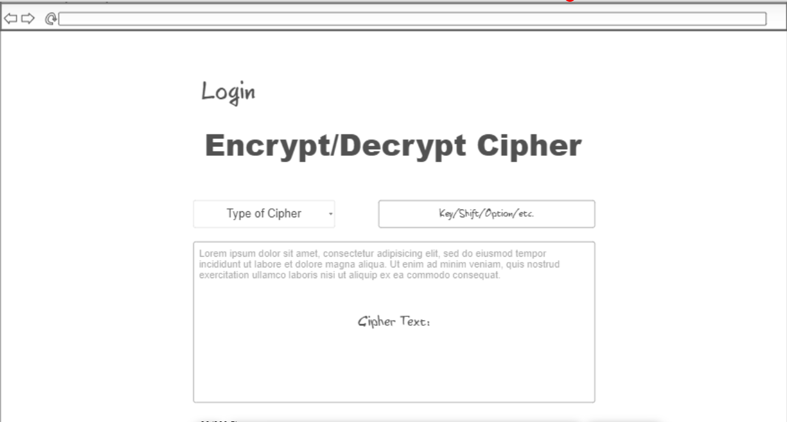
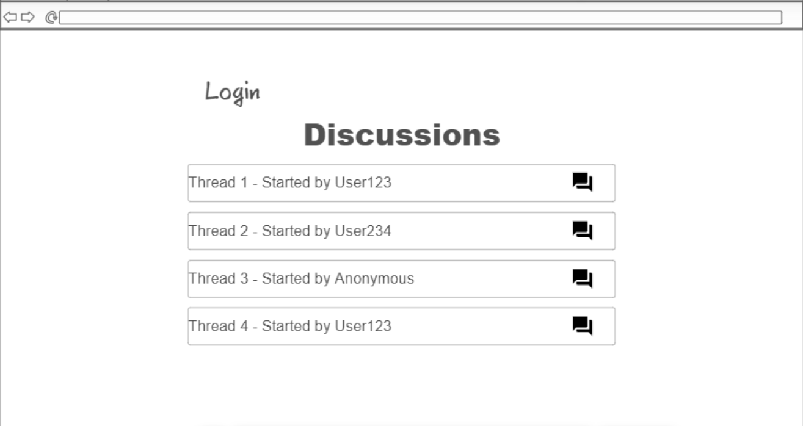
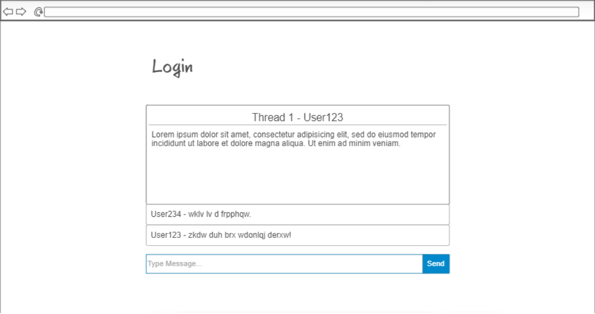

# Cipher Application
A Startup Application for BYU CS 260
## Specification Deliverable
### Elevator Pitch
Have you ever been on the internet, perhaps on an online forum discussing a puzzle solution, when you suddenly get hit with the "gur vasbezngvba vf va gur gnfx". Or you're watching your favorite kids show containing a big mystery element when you spot some text in the credits looking like this: "judylwb idoov". These types of text are called cipher text, and they are used to hide important information from the reader unless they are willing to decipher the text themselves. Perhaps you have some important information yourself that you want to encrypt into cipher text. That's where the Cipher application comes into play. With this application, you can encipher/decipher text into its encrypted/decrypted self. There is also a discussion forum to discuss these types of ciphers especially in the case where you are unable to decipher the text yourself.
### Design

### Key Features
- Secure login over HTTPS
- Ability to select the cipher to encrypt/decrypt
- Ability to encrypt/decrypt a plaintext/cipher message
- Ability to communicate with other users through a discussion forum
- Ability to create a new thread and comment on existing threads in realtime
### Technologies
I am going to use the required technologies in the following ways.

- **HTML** - Uses correct HTML structure for application. Four HTML pages. One for login, one for encrypting/decrypting, one for viewing threads, and one for viewing/commenting on a specific thread.
- **CSS** - Application styling that looks good on different screen sizes, uses good whitespace, color choice and contrast.
- **React** - Provides login, cipher text display, display threads, display users' comments on threads, and use of React for routing and components.
- **Service** - Backend service with endpoints for:
  - login
  - retrieving threads and associated comments
  - submitting threads and associated comments
- **DB/Login** - Store users, threads, and comments in database. Register and login users. Credentials securely stored in database. Can't comment on threads unless authenticated.
- **WebSocket** - As each user comments on a thread, their comment is broadcast to all other users.
## HTML deliverable

For this deliverable I built out the structure of my application using HTML.

- [x] **HTML pages** - Six HTML pages that represent the home page, the application page, a page to login, two other pages to view discussions and discuss with other users, and another page detailing the application.
- [x] **Links** - Each link goes to its corresponding page, you are also able to reach the thread page by clicking on a discussion box which is how it will be done in the final version.
- [x] **Text** - All the discussions are currently represented by text in boxes.
- [X] **Images** - Added a placeholder image for now, unsure if I will need an image in the future.
- [x] **DB/Login** - Input box and submit button for login. The discussion and thread pages will have conversations that pull from the database.
- [x] **WebSocket** - Thread comments will update in real-time.
## CSS deliverable

For this deliverable I properly styled the application into its final appearance.

- [x] **Header, footer, and main content body**
- [x] **Responsive to window resizing** - My app looks great on all window sizes and devices
- [x] **Navigation elements** - I used Bootstrap to make a responsive and easy-looking navigation bar at the top.
- [x] **Application elements** - Used good contrast and whitespace
- [x] **Application text content** - Consistent fonts
- [x] **Application images** - I've stylized the placeholder image, but I'm unsure if it will stay.
- [ ] **Application color** - It's pretty basic right now but I have a plan to give a unique color scheme for the application, I just need to make sure it looks good first.
## React deliverable

For this deliverable I converted my startup frontend over to React and added javascript for functionality.

- [X] **Bundled using Vite** - done!
- [X] **Components** - Home, login, application, discussion, and thread are all components.
  - [X] **Login** - This component is simply mocked.
  - [X] **Discussion & Thread** - Added CSS animation when a discussion div is clicked that routes to the thread component (removed from the navigation bar). Both components of which will be replaced by database and WebSocket data.
  - [X] **Application Logic** - Added Javascript to allow encryption/decryption of plain text using specific ciphers.
- [X] **Router** - Routing between each of the components.
- [X] **Hooks** - The plain-text, cipher-text, encryption/decryption state, key, and cipher all operate with `UseState`.
- [X] **Icon** - Added a favicon.ico, although it may change in the future.
